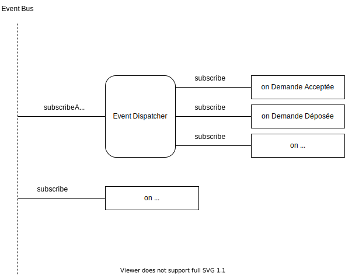
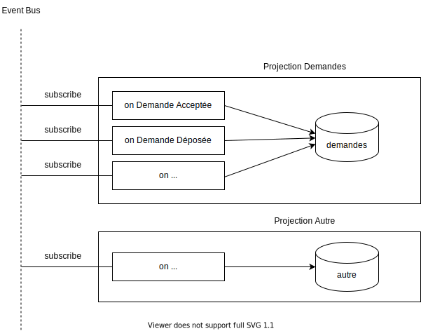
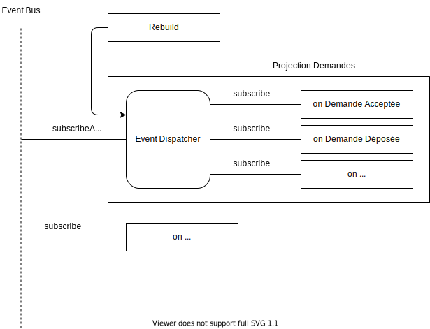

# Event Dispatcher

## Concept
Son role est de jouer d'intermediaire entre un event bus partagé et des handlers.
Au lieu d'avoir des handlers qui sont branchés directement sur l'event bus, ils sont branchés sur le dispatcher qui, lui, écoute l'event bus.

## Utilisations

Dans le cadre d'une projection, on a un ensemble de scripts projecteurs, qui ont chacun un comportement à executer pour chaque événement (ex: ajouter une ligne dans la table correspondante).

Une implémentation naïve, sans dispatcher, brancherait chacun de ces projecteurs sur l'event bus. 

  
Cependant, lors d'une rebuild de cette projection, nous devons aussi executer chacun de ces projecteurs pour chacun des événements contenus dans l'historique. Nous devons donc avoir un accès aux projecteurs associés à une projection.  

L'utilisation d'un event dispatcher pour chaque projection, permet de maintenir une liste des projecteurs liés à cette projection.

L'event dispatcher joue son rôle dans les deux contextes:
- Lors du lancement de l'application, l'event dispatcher se branche sur l'event bus.
- Lors d'un rebuild d'une projection, nous passons chaque événement de l'historique un par un à son event dispatcher et il transmets aux projecteurs attachés.

Il présente aussi un intérêt en terme d'organisation du code:
- Quand on déclare un projecteur
  - Sans Event Dispatcher
    - on doit le relier à l'instance d'event bus
    - on doit l'ajouter dans une liste de projecteurs associés à la projection
  - Avec Event Dispatcher
    - on déclare, en une seule fois, le projecteur auprès de l'event dispatcher

